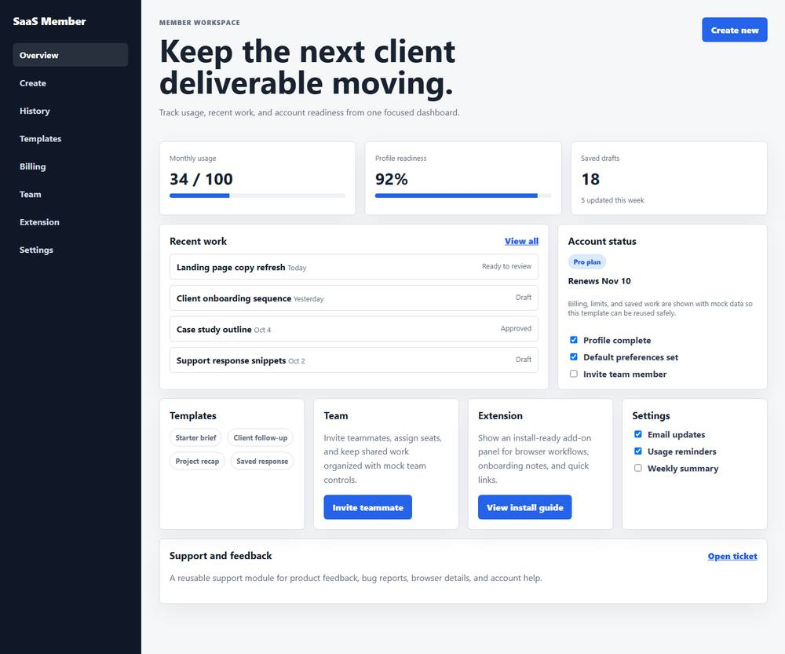

# SaaS Member Dashboard Template

A public-ready **SaaS member dashboard template** for user-facing product portals. It includes the core workflows expected in a modern SaaS account area: overview, usage, saved work, profile readiness, billing, team, integrations, settings, and support.

This repository uses mock data only. It does not include production credentials, private users, payment keys, internal documents, or copied private Git history.

## Preview



## Feature Coverage

- SaaS member dashboard overview
- Usage quota and monthly activity cards
- Saved work history
- Recent item status tracking
- Profile readiness checklist
- Billing status mock
- Plan and renewal display mock
- Team invite panel mock
- Browser extension or add-on install panel mock
- Account settings panel mock
- Notification preference panel mock
- Support and feedback panel mock
- Responsive sidebar layout
- Public-safe `.env.example`
- Local quality check for accidental secrets

## Screens Included

- Overview
- Create action placeholder
- History preview
- Templates preview
- Billing mock
- Team mock
- Extension mock
- Settings mock
- Support mock

## Need a Custom Version?

This template is a public demo for a SaaS member area. If you are building a real product, this can become a production-ready customer portal with authentication, billing, usage data, support, and account management.

Custom build options can include:

- User authentication and account settings
- Real usage tracking
- Billing and subscription integration
- Saved work or document history
- Team invites and permissions
- Support ticket flow
- Notification preferences
- Product onboarding checklist
- Admin controls for customer management

If you are building a SaaS product, customer portal, internal tool, or MVP dashboard and want it to feel credible from day one, connect with me on LinkedIn: [Yaver Abbas](https://www.linkedin.com/in/yawarak/).

## Related Open Source Templates

- [Upwork Proposal Generator AI](https://github.com/yaverabbas/upwork-proposal-generator-ai)
- [SaaS Admin Dashboard Template](https://github.com/yaverabbas/saas-admin-dashboard-template)

## Deployment Guide

This template is static HTML, CSS, and JavaScript.

### GitHub Pages

1. Create a public GitHub repo.
2. Push this folder.
3. Open **Settings → Pages**.
4. Choose **Deploy from a branch**.
5. Select `main` and `/root`.
6. Save.

### Netlify

1. Create a new site from GitHub.
2. Select this repo.
3. Leave build command empty.
4. Set publish directory to `/`.
5. Deploy.

### Vercel

1. Import this repo.
2. Framework preset: **Other**.
3. Leave build command empty.
4. Output directory: `/`.
5. Deploy.

## Local Preview

Open `index.html` in a browser.

For a local server:

```bash
npx serve .
```

## Safety Check

Run:

```bash
node tools/quality-check.mjs
```

## Suggested GitHub Description

SaaS member dashboard template with usage, history, billing mock, profile readiness, team, settings, and support UI.

## Suggested Topics

`saas`, `member-dashboard`, `user-dashboard`, `dashboard-template`, `account-portal`, `frontend-template`, `portfolio-project`
